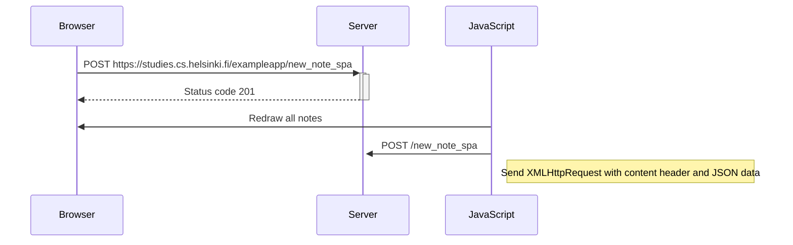

```mermaid
sequenceDiagram
    participant Browser
    participant Server
    participant JavaScript

    Browser->>+Server: POST https://studies.cs.helsinki.fi/exampleapp/new_note_spa
    activate Server
    Server-->>-Browser: Status code 201
    deactivate Server

    JavaScript->>Browser: Redraw all notes
  
    JavaScript->>+Server: POST /new_note_spa
    Note right of JavaScript: Send XMLHttpRequest with content header and JSON data

```
